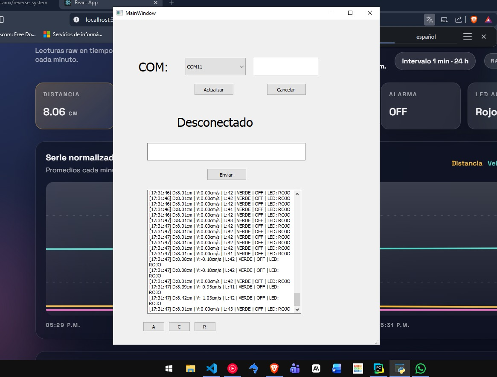
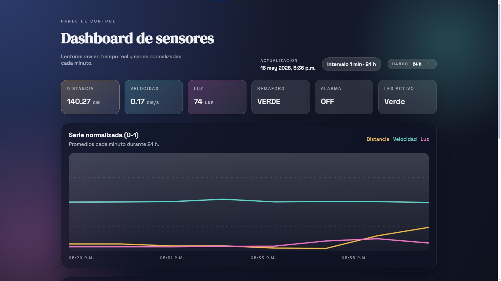
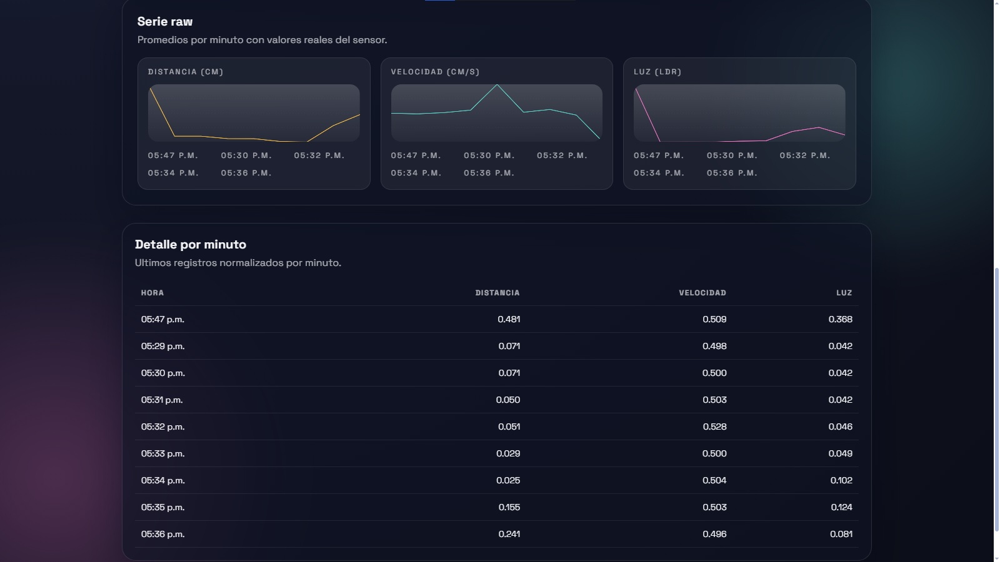
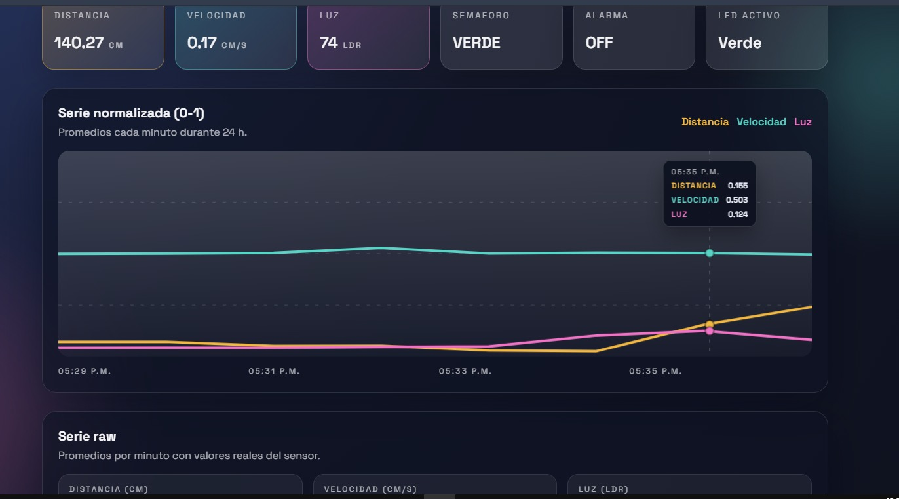

# Sistema de Monitoreo de Muelle con Semaforo Ultrasonico

Sistema embebido de monitoreo en tiempo real para control de aproximacion de embarcaciones a un muelle, desarrollado con Arduino, Python y Node.js.

## Descripcion

El sistema utiliza un sensor ultrasonico HC-SR04 para medir la distancia y velocidad de aproximacion de una embarcacion al muelle. Con base en estos datos, activa un semaforo de LEDs y un buzzer como sistema de alerta progresiva. Los datos se transmiten en tiempo real a una interfaz grafica en Python, se almacenan en una base de datos MySQL y se normalizan automaticamente para su analisis.

## Tecnologias

| Capa | Tecnologia |
| --- | --- |
| Hardware | Arduino UNO, HC-SR04, LDR, LEDs, Buzzer |
| Interfaz grafica | Python 3, PyQt5 |
| Backend API | Node.js, Express |
| Base de datos | MySQL 9.6 |
| Comunicacion | Serial (USB), HTTP REST |

## Funcionalidades

- Medicion de distancia en tiempo real con filtro de mediana
- Calculo de velocidad de aproximacion con promedio movil
- Semaforo fisico (Verde / Amarillo / Rojo) con parpadeo progresivo segun distancia
- Buzzer con frecuencia de alerta proporcional a la proximidad
- Faro automatico controlado por sensor LDR con modo manual
- Interfaz grafica PyQt5 con monitor en tiempo real
- Exportacion de datos a CSV
- API REST (Node.js + Express) con endpoints GET y POST
- Normalizacion Min-Max automatica de datos de sensores
- Almacenamiento en tres tablas MySQL: datos crudos, agregados por minuto y normalizados

## Estructura del proyecto

```
api-sensores/
├── package.json
├── assets/
│   ├── dashboard_images/       # Capturas
│   └── recursos/
│       ├── arduino/
│       │   └── sistema_telemetria.ino   # Firmware Arduino
│       └── python/
│           ├── dep.py                   # Interfaz grafica PyQt5 + envio a API
│           ├── interfaz.py              # UI generada por Qt Designer
│           ├── DisenoDeInterfaces.ui    # Archivo de diseno Qt
│           └── normalizacion_datos.py   # Normalizacion Min-Max de sensores
├── reverse_system/
│   └── panel_admin/             # Panel web (React)
└── src/
    ├── server.js                # Servidor Express
    ├── db.js                    # Conexion MySQL
    └── routes/
        ├── data.routes.js
        ├── dashboard.routes.js
        └── normalized.routes.js
```

## Instalacion y uso

### 1. Base de datos

```sql
-- Ejecutar en MySQL Workbench o SQLyog
source crear_tabla.sql
source normalizar_dataset.sql
```

### 2. API REST (Node.js)

```bash
cd api-sensores
npm install
npm run dev
```

### 3. Interfaz Python

```bash
pip install pyserial PyQt5 requests mysql-connector-python
python dep.py
```

### 4. Arduino

Cargar `semaforo.ino` desde el IDE de Arduino al microcontrolador.

## Endpoints de la API

| Metodo | Endpoint | Descripcion |
| --- | --- | --- |
| GET | `/api/data` | Todos los registros crudos |
| GET | `/api/data/latest` | Ultimo registro |
| GET | `/api/data/recientes?limit=100` | Ultimas N lecturas |
| GET | `/api/data/stats` | Estadisticas generales |
| GET | `/api/data/minutos?limit=60` | Datos agregados por minuto |
| GET | `/api/data/normalizada` | Datos normalizados [0-1] |
| POST | `/api/data` | Guardar nueva lectura |
| POST | `/api/data/agregar` | Ejecutar agregacion por minuto |

## Normalizacion de datos

Los datos de los sensores se normalizan automaticamente al rango [0, 1] usando Min-Max:

| Sensor | Rango crudo | Normalizado |
| --- | --- | --- |
| Distancia (HC-SR04) | 0-400 cm | 0.0-1.0 |
| Velocidad | -50-50 cm/s | 0.0-1.0 (0.5 = quieto) |
| Luz (LDR) | 0-1023 | 0.0-1.0 |

## Comandos del sistema

| Boton | Comando | Accion |
| --- | --- | --- |
| AUTO | `R` | Restaura modo automatico completo |
| BUZZER | `A` | Apaga el buzzer |
| FARO | `C` | Enciende el faro fijo (ignora LDR) |

## Capturas






## Autor

Desarrollado como proyecto
